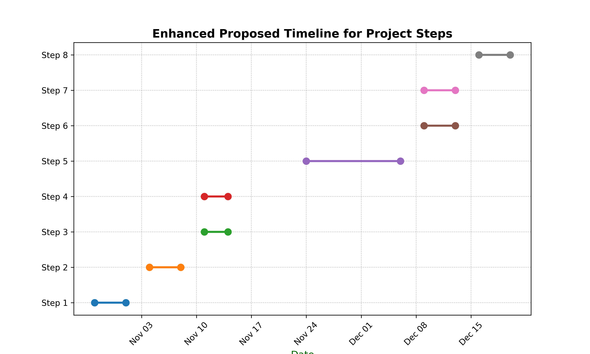

# **Cinema Through Time: How Seasons and History Shape the Movies We Watch**

## **Table of Contents**
1. [Abstract](#abstract)  
2. [Research Questions](#research-questions)  
3. [Additional Dataset](#Additional-Datasets)  
4. [Methods](#methods)  
5. [Proposed Timeline](#proposed-timeline)  
6. [Organization Within the Team](#organization-within-the-team)  
7. [Questions for TAs](#questions-for-tas) 

## **Abstract**
Our project explores how significant historical events and seasonal trends influence the films we watch, reflecting society’s evolving narratives. By examining the impact of events like World Wars, economic recessions, and modern-day challenges, we aim to uncover patterns in how cinema adapts to cultural shifts. This study analyzes genre popularity across seasons, such as horror in October and family films in December, to determine whether specific genres align with particular times of the year. Our goal is to reveal how historical context and seasonal preferences shape the evolution of cinema and connect audiences to stories that resonate with societal highs and lows.

## **Research Questions**

1. **How do significant historical events shape movie genres and themes?**
   - **Objective**: Investigate whether major events (e.g., World Wars, economic recessions) influence shifts in film genres and storytelling themes.
   - **Hypothesis**: During societal upheaval or recovery, genres like drama and war films may increase, while lighter genres might decline. Conversely, comedies and romantic genres may flourish in stable periods.

2. **Are specific movie genres consistently more popular in certain seasons?**
   - **Objective**: Determine if and how seasonal trends influence genre popularity, possibly aligning with cultural events like Halloween or the holiday season.
   - **Hypothesis**: Some genres align with specific times of year—e.g., horror in October, blockbusters in summer, and family movies in December—reflecting audience expectations across seasons.

4. **What are the most common genres during periods of socio-political upheaval?**
   - **Objective**: Analyze how movie production and genre popularity change in response to socio-political events.
   - **Hypothesis**: In times of upheaval, genres like drama and thriller may rise as filmmakers respond to societal tensions. Stable periods may encourage escapist genres like comedy and adventure.

5. **What is the optimal season for releasing movies in various genres?**
   - **Objective**: Identify the best season for releasing different genres to maximize audience engagement and revenue.
   - **Hypothesis**: High-budget action films may perform best in summer, while dramas may find success during award season in the latter part of the year.

## **Additional Dataset**

Alongside CMU, we will use the TMDB Movies Dataset 2024 from Kaggle, which provides a comprehensive collection of 1 million movies with metadata such as titles, release dates, genres, revenue, and popularity scores. This dataset will complement CMU Personas by filling in missing values, particularly in revenue and popularity fields, enhancing the overall data quality. The integration of TMDB data allows us to standardize genres and dates across datasets, ensuring consistency. Additionally, the enriched features from TMDB will enable us to perform a more in-depth analysis of seasonal trends and historical impacts, offering a fuller picture of audience preferences over time.

## **Methods**

1. **Data Collection & Cleaning**: We will use the *CMU* dataset combined with the *TMDB Movies Dataset 2024* dataset to enhance our analysis. This step involves standardizing titles, genres, and dates and addressing missing values, particularly in revenue. This integration builds a reliable database that captures both historical context and movie-specific details.

2. **Exploratory Data Analysis (EDA)**: Conduct initial EDA to visualize genre distribution, and popularity across historical periods and seasons. Using bar charts and time series, we’ll assess patterns and variations in popularity and revenue, setting the foundation for deeper analysis.

3. **Seasonal Trend Analysis**: We’ll apply statistical tests (e.g., chi-square, ANOVA) to examine genre popularity by season, testing hypotheses on genre-season associations such as horror’s peak in October and family movies’ rise in December.

4. **Historical Impact Analysis**: We’ll conduct regression analysis to assess the impact of major historical events on genre shifts and thematic changes. We’ll investigate genre transformations in response to events like wars, economic crises, and socio-political shifts.

5. **Revenue Analysis Over Time**: Using time series analysis, we’ll track revenue patterns by season and historical context, identifying financially significant periods. This will reveal seasonal and event-based revenue peaks.

6. **Clustering for Genre and Country Insights**: We’ll apply clustering algorithms, like K-means, to identify patterns in genre preferences based on release season and country, aiming to uncover optimal release strategies based on cultural and regional differences.

7. **Sentiment Analysis**: Using NLP, we’ll analyze plot summaries to capture sentiment and thematic tones. This will add depth to our analysis of genre and theme changes across historical events.

8. **Data Visualization**: We’ll create interactive visualizations to illustrate genre-season relationships, revenue trends, and historical impact on cinema, using heatmaps and bubble charts to communicate our findings clearly.

## **Proposed Timeline**

1. **Step 1 (28.10.2024 - 01.11.2024)**: Integrate CMU and TMDB datasets, standardize formats, and address missing values.
2. **Step 2 (04.11.2024 - 08.11.2024)**: Conduct EDA, create visualizations, and identify trends.
3. **Step 3 (11.11.2024 - 14.11.2024)**: Analyze seasonal genre trends using statistical methods.
4. **Step 4 (11.11.2024 - 14.11.2024)**: Perform regression analysis on historical events' impact.
5. **Step 5 (02.12.2023 - 06.12.2024)**: Apply time series analysis to revenue patterns.
6. **Step 6 (09.12.2023 - 13.12.2024)**: Conduct clustering for genre and regional preferences.
7. **Step 7 (09.12.2023 - 13.12.2024)**: Perform sentiment analysis on plot summaries.
8. **Step 8 (16.12.2023 - 20.12.2024)**: Finalize visualizations, compile findings, and complete the report.

## **Organization Within the Team**

- **Dataset Preparation**: Milica & Marija - Integrate datasets, address missing values.
- **Data Exploration**: Marija & Eugenio - Conduct EDA and create visualizations.
- **Seasonal Trends Analysis**: Milica & Marija - Analyze genre popularity by season.
- **Historical Impact Analysis**: Daniela & Marija - Explore genre shifts due to historical events.
- **Revenue Analysis**: Andrea & Eugenio - Perform time series analysis on revenue.
- **Clustering Analysis**: Milica & Eugenio - Analyze genre and country preferences.
- **Sentiment Analysis**: Daniela & Andrea - Analyze plot sentiment.
- **Final Report and Visualization**: Marija, Andrea & Daniela - Develop visualizations and finalize the report.

## **Questions for TAs**  
- Do you have recommendations on tools for visualizing seasonal and historical trends effectively?  
- Should we prioritize a specific method for clustering genres and countries, or experiment with multiple algorithms? 

---

