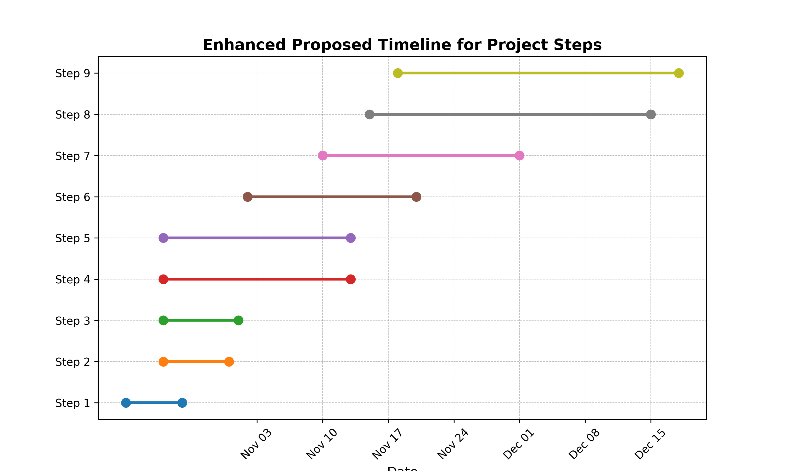

# **Cinema Through Time: How Seasons and History Shape the Movies We Watch**

## **Abstract**
Our project explores how significant historical events and seasonal trends influence the films we watch, reflecting society’s evolving narratives. By examining the impact of events like World Wars, economic recessions, and modern-day challenges, we aim to uncover patterns in how cinema adapts to cultural shifts. This study analyzes genre popularity across seasons, such as horror in October and family films in December, to determine whether specific genres align with particular times of the year. Our goal is to reveal how historical context and seasonal preferences shape the evolution of cinema and connect audiences to stories that resonate with societal highs and lows.

## **Table of Contents**
1. [Project structure](#project-structure)
2. [Research Questions](#research-questions)  
3. [Additional Dataset](#Additional-Datasets)  
4. [Methods](#methods)  
5. [Proposed Timeline](#proposed-timeline)  
6. [Organization Within the Team](#organization-within-the-team)  
7. [Questions for TAs](#questions-for-tas) 

## **Project structure**

The directory structure of the project is as follows:

```
ADA-2024-PROJECT-SEMEX24/
│
├── data/                         <- Project data files
│   ├── character.metadata.tsv     <- Character metadata
│   ├── movie.metadata.tsv         <- Movie metadata
│   ├── movies_dataset.tsv         <- Dataset for movies
│   └── plot_summaries.txt         <- Plot summaries for analysis
│
├── src/                           <- Source code
│   ├── data/                      <- Data loading and processing
│   │   └── data_loader.py         <- Script to load and preprocess data
│   ├── media/                     <- Media files for the project
│   │   └── timeline_chart.png     <- Timeline chart image
│   ├── scripts/                   <- Jupyter Notebooks for various analyses
│   │   ├── data_cleaning.ipynb    <- Notebook for cleaning data
│   │   ├── Main_analysis.ipynb    <- Main analysis notebook
│   │   └── Sentimental Analysis.ipynb <- Sentiment analysis notebook
│   └── utils/                     <- Utility scripts for analysis
│       ├── EDA.py                 <- Exploratory Data Analysis functions
│       ├── historical.py          <- Functions for historical analysis
│       ├── sentimental_analysis.py<- Sentiment analysis functions
│       └── sesonal.py             <- Functions for seasonal analysis
│
├── .gitignore                     <- List of files ignored by git
├── environment.yml                <- File for setting up the Python environment
├── README.md                      <- Project README file
└── results.ipynb                  <- A well-structured notebook for final results
```

## **Research Questions**

1. **How do major historical events shape the genres and themes of movies?**
   - **Objective**: Examine how significant historical events (e.g., wars, economic crises, political changes) influence shifts in dominant genres and narrative themes, reflecting societal issues and aspirations through cinema.

2. **What seasonal trends exist in the popularity of specific movie genres?**
   - **Objective**: Identify patterns in genre popularity aligned with specific times of the year (e.g., horror in fall, family films in winter) and assess whether these seasonal trends have evolved over time in response to cultural or societal shifts.

3. **How do historical periods and seasonal timing influence movie budgets?**
   - **Objective**: Investigate whether certain historical periods or specific release seasons (like summer) are associated with higher production budgets, analyzing how external factors affect investment in movie production.

4. **What impact do release season and historical context have on a movie's box office revenue?**
   - **Objective**: Explore how the timing of a movie’s release, combined with the historical context, affects its financial performance, identifying optimal release strategies and the role of external influences on revenue outcomes.

5. **How does the sentiment in plot summaries reflect major historical events?**
   - **Objective**: Analyze the emotional tone in plot summaries across different historical periods, exploring how the sentiments expressed in cinema align with or react to the emotional climate of the time.


## **Additional Dataset**

Alongside CMU, we will use the TMDB Movies Dataset 2024 from Kaggle, which provides a comprehensive collection of 1 million movies with metadata such as titles, release dates, genres, revenue, and popularity scores. This dataset will complement CMU Personas by filling in missing values, particularly in revenue and popularity fields, enhancing the overall data quality. The integration of TMDB data allows us to standardize genres and dates across datasets, ensuring consistency. Additionally, the enriched features from TMDB will enable us to perform a more in-depth analysis of seasonal trends and historical impacts, offering a fuller picture of audience preferences over time.

   Source: https://www.kaggle.com/datasets/asaniczka/tmdb-movies-dataset-2023-930k-movies?resource=download 

## **Methods**

1. **Data Collection & Cleaning**: We will use the *CMU* dataset combined with the *TMDB Movies Dataset 2024* dataset to enhance our analysis. This step involves standardizing titles, genres, and dates and addressing missing values, particularly in revenue. This integration builds a reliable database that captures both historical context and movie-specific details.

2. **Exploratory Data Analysis (EDA)**: Conduct initial EDA to visualize genre distribution, and popularity across historical periods and seasons. Using bar charts and time series, we’ll assess patterns and variations in popularity and revenue, setting the foundation for deeper analysis.

3. **Seasonal Trend Analysis**: We’ll apply statistical tests (e.g., chi-square, ANOVA) to examine genre popularity by season, testing hypotheses on genre-season associations such as horror’s peak in October and family movies’ rise in December.

4. **Historical Impact Analysis**: We’ll conduct regression analysis to assess the impact of major historical events on genre shifts and thematic changes. We’ll investigate genre transformations in response to events like wars, economic crises, and socio-political shifts.

5. **Revenue Analysis Over Time**: Using time series analysis, we’ll track revenue patterns by season and historical context, identifying financially significant periods. This will reveal seasonal and event-based revenue peaks.

6. **Clustering for Genre and Country Insights**: We’ll apply clustering algorithms, like K-means, to identify patterns in genre preferences based on release season and country, aiming to uncover optimal release strategies based on cultural and regional differences.

7. **Sentiment Analysis**: Using NLP, we’ll analyze plot summaries to capture sentiment and thematic tones. This will add depth to our analysis of genre and theme changes across historical events.

8. **Data Visualization**: We’ll create interactive visualizations to illustrate genre-season relationships, revenue trends, and historical impact on cinema, using heatmaps and bubble charts to communicate our findings clearly.


## **Proposed Timeline**

1. **Step 1 (20.10.2024 - 26.10.2024)**:  
   - Dataset Preparation: Integrate CMU and TMDB datasets, standardize formats, and address missing values.

2. **Step 2 (24.10.2024 - 31.10.2024)**:  
   - Data Exploration: Conduct exploratory data analysis (EDA), create initial visualizations, and identify trends.

3. **Step 3 (24.10.2024 - 01.11.2024)**:  
   - Seasonal Trends Analysis: Analyze genre popularity by season using statistical methods.

4. **Step 4 (24.10.2024 - 13.11.2024)**:  
   - Historical Impact Analysis: Explore genre shifts due to historical events and perform regression analysis to assess impact.

5. **Step 5 (24.10.2024 - 13.11.2024)**:  
   - Revenue Analysis: Apply time series analysis to examine revenue patterns over time and across seasons.

6. **Step 6 (02.11.2024 - 20.11.2024)**:  
   - Clustering Analysis: Conduct clustering for genre and regional preferences to identify patterns in audience demographics.

7. **Step 7 (10.11.2024 - 01.12.2024)**:  
   - Sentiment Analysis: Perform sentiment analysis on plot summaries to assess emotional tone during historical events.

8. **Step 8 (15.11.2024 - 15.12.2024)**:  
   - GitHub Pages Setup: Develop a GitHub Pages site for the project to display findings and visualizations interactively.

9. **Step 9 (15.11.2024- 18.12.2024)**:  
   - Final Report and Submission: Compile findings into a comprehensive report and finalize all project documentation for submission.complete the report.



## **Organization Within the Team**


- **Step 1**:  Milica, Marija & Eugenio

- **Step 2**: Marija, Andrea & Daniela

- **Step 3**:  Milica & Eugenio

- **Step 4**:  Daniela & Andrea

- **Step 5**: Marija & Milica

- **Step 6**:Eugenio & Andrea

- **Step 7**: Daniela, Eugenio & Marija

- **Step 8**:  Milica & Andrea

- **Step 9**: Marija, Andrea & Daniela

## **Questions for TAs**  
- Do you have recommendations on tools for visualizing seasonal and historical trends effectively?  
- For sentiment analysis on plot summaries, would you recommend any particular NLP techniques or libraries, given our dataset size and focus on historical events?
- Are there any best practices for setting up a GitHub Pages site, especially when embedding interactive visualizations?
- Do you have any advice on how to frame our conclusions to better highlight how historical and seasonal factors shape the movie industry, without overextending the interpretation of our data?
---

